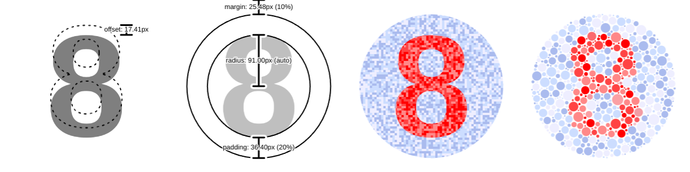

# ishihara

Generate [Ishihara test plate](https://en.wikipedia.org/wiki/Ishihara_test) images for color vision deficiency testing.

## Installation

`npm i @mtillmann/ishihara`

## Usage

The `ishihara` function takes an options-object (see below) and returns an instance of `CirclePacker` from the [circlepacker-package](https://github.com/Mtillmann/circlepacker).

Use any of `CirclePacker`'s [output helper methods](https://github.com/Mtillmann/circlepacker?tab=readme-ov-file#output-helpers) to render the image.

You can pass a [CirclePacker-options-object](https://github.com/Mtillmann/circlepacker?tab=readme-ov-file#options) inside the `options.circlePackerOptions` property.


### Using a Bundler

```javascript
import ishihara from '@mtillmann/ishihara';

const image = ishihara().asCanvas();
document.body.appendChild(image);
```

### Module Script Tag

```html
<script type="module">
  import ishihara from '.../@mtillmann/ishihara/dist/index.bundle.js';

  const image = ishihara().asCanvas();
  document.body.appendChild(image);
</script>
```

### Classic Script Tag

```html
<script src=".../@mtillmann/ishihara/dist/index.bundle.iife.js"></script>
<script>
  const image = ishihara().asCanvas();
  document.body.appendChild(image);
</script>
```

## Options

The `ishihara` function takes an options object with the following properties:

| Option              | Type                         | Default                 | Description                                                                    |
| ------------------- | ---------------------------- | ----------------------- | ------------------------------------------------------------------------------ |
| circlePackerOptions | Partial<circlePackerOptions> | {}                      | [Options for the CirclePacker](https://github.com/Mtillmann/circlepacker)                                                  |
| textColors          | string[]                     | ['#ffffff']             | Colors for the text                                                            |
| backgroundColors    | string[]                     | ['#000000']             | Colors for the background                                                      |
| text                | string                       | '8'                     | Text to display, max 2 characters                                              |
| font                | string                       | 'bold 256px sans-serif' | Font for the text                                                              |
| radius              | number \| 'auto'             | 'auto'                  | Radius of the circles, 'auto' will calculate the radius based on the text size |
| padding             | number \| string             | '20%'                   | Padding around the text, can be a number or a percentage                       |
| margin              | number \| string             | '10%'                   | Margin around the image, can be a number or a percentage                       |
| debug               | boolean                      | false                   | renders debug image with same output api as CirclePacker                       |

